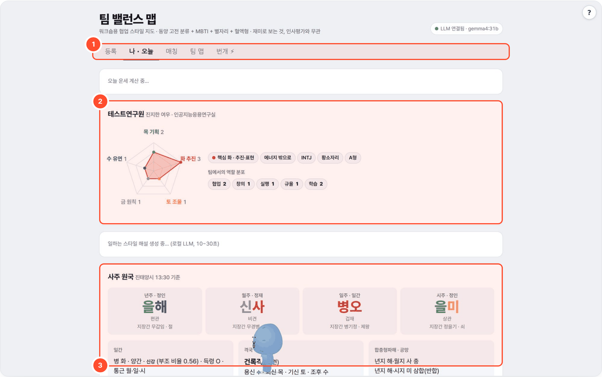
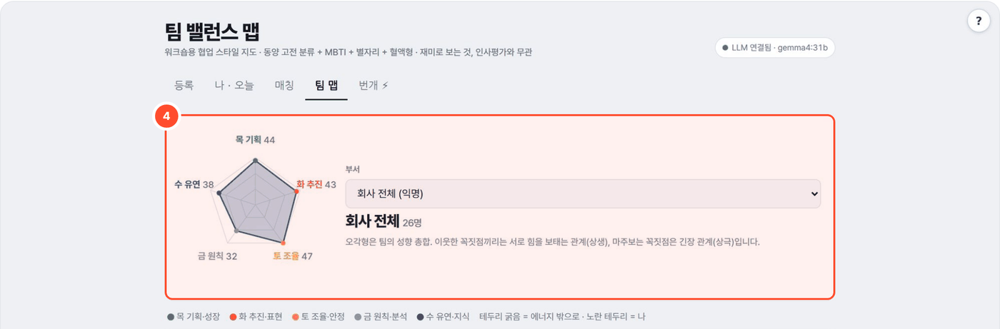

# 팀 밸런스 맵 (saju-local)

> 사주·MBTI·별자리·혈액형을 섞어 개인 성향 차트와 팀원 간 "협업 스타일 궁합"을 그래프로 보여주는 워크숍용 도구. 재미로 보는 것이며 과학적 근거가 없고 인사평가와 무관합니다.



## 무엇을 하나
- 양력 생년월일(+출생 시, MBTI·혈액형 선택)로 사주 원국을 계산하고, 오행 성향 오각형과 팀 내 역할 분포를 보여 줍니다.
- 부서 또는 회사 전체(익명)의 성향 분포와 궁합 연결을 팀 맵 그래프로 봅니다.
- 폐쇄망용: Python 3.9+ 표준 라이브러리만, 외부 패키지·CDN 0. LLM은 해설 문장 생성에만 쓰고, 없으면 규칙 문장으로 대체합니다.

## 사용 방법
번호는 위·아래 화면의 번호 상자와 같습니다.

1. **기능 탭**(①) — 등록 · 나·오늘 · 매칭 · 팀 맵 · 번개 ⚡ 를 오갑니다. 먼저 **등록**에서 양력 생년월일과 출생 시각(모름 허용), 선택 항목인 MBTI·혈액형을 입력합니다.
2. **성향 차트**(②) — **나·오늘** 탭에서 오행 오각형과 역할 분포(협업·창의·실행·규율·학습)를 확인합니다.
3. **사주 원국**(③) — 년·월·일·시 네 기둥과 십신·지장간·신강약·격국·용신 등 계산 결과와 해설을 읽습니다.
4. **전체 성향 분포**(④) — **팀 맵** 탭에서 부서 또는 회사 전체(익명)를 골라 오행 분포를 봅니다.
5. **팀 맵 그래프**(⑤, 아래 캡처에서는 다른 참가자 별명이 보이지 않도록 잘라냄) — 선 길이 = 궁합, 노드 색 = 핵심 성향으로 관계를 봅니다.



## 예시
기존 실행 결과(2026-10-07, 가상 프로필):

- 입력: **테스트연구원**(가상) · 양력 1995-05-15 · 출생 14시 · INTJ · A형
- 출력: 별명 **진지한 여우** · 원국 **을해 / 신사 / 병오 / 을미** · 오행 개수 목 2 · 화 3 · 토 1 · 금 1 · 수 1 · 진태양시 보정 시각 13:30

시간 계산은 출생지 경도 127.5°를 기본으로 쓰고 균시차는 적용하지 않습니다.

## 설치·실행
```bash
python3 selftest.py                 # 만세력·궁합·번개 필터 자가검증
python3 seed.py                     # 더미 24명 + 번개 4개 (기존 데이터 삭제). 더미 계정 로그인 URL 출력
python3 app.py                      # 단독 실행 http://localhost:8766 (포털에서는 PORT=8775 로 띄워 /t/saju-local/)
LLM_BASE_URL=http://localhost:11436 LLM_MODEL=gemma4:31b python3 app.py          # 로컬 Ollama + gemma4:31b (포털 기본값)
LLM_BASE_URL=http://gpu:8000/v1 LLM_API=openai LLM_MODEL=qwen3-32b python3 app.py   # vLLM 등
```

| 환경변수 | 기본 | 설명 |
|---|---|---|
| `LLM_API` / `LLM_BASE_URL` / `LLM_MODEL` | ollama / :11434 / qwen3:8b | 포털이 띄울 때는 로컬 Ollama `:11436` + `gemma4:31b` 를 넘김 |
| `PORT` | 8766 | 포털 등록 포트는 8775 |
| `WORKSPACE` | `data/` | `people.json` 등 데이터 위치. 포털이 `AGENT_DATA/saju-local` 로 지정 |

## 기능
- 등록: 양력 생년월일 + 출생 시(모름 허용) + MBTI/혈액형(선택). 별자리는 자동.
- 나·오늘: 성향 오각형(오행 레이더), 역할 분포(십신→역할어), 오늘의 팁·연구 운·협업 운·점심 메뉴(일진 기반 규칙 + LLM 문장, 하루 캐시), 일하는 스타일 해설(LLM 4문단). 헤더에 LLM 연결 상태 표시.
- 매칭: 회사 전체(익명, 별명·부서·연령대만) / 우리 팀(실명). 연령대·MBTI·핵심 성향 필터. 결과 3명 미만이면 익명 보호로 미표시.
- 번개 ⚡: 제목·장소·시간(N분 뒤)·취미 태그·정원. 취미가 같고 **양방향 성향 필터**(내가 원하는 성향↔상대 성향, 상대가 원하는 성향↔내 성향)를 통과한 사람에게만 보임. 참여하면 서로 실명 공개. 호스트에겐 "N명에게 보임" 표시. 30초 폴링.
- 취미·성향: 취미 태그 + 성향 10축(에너지·말·계획·주도·새로움·인원·승부·유머·술·일얘기, 각 왼쪽/상관없음/오른쪽). "내 성향"과 "같이 놀고 싶은 성향"을 따로 기록. 내 프로필 탭에서 수정.
- 팀 맵: 부서별/전체 스프링 그래프. 선 길이 = 궁합, 노드 색 = 핵심 성향, 크기 = 에너지 방향. 부서 성향 균형 막대.

## 사주 계산 (saju.py)
- 절기: VSOP87D 지구 급수(Meeus) + 장동·광행차 + ΔT → 24절기 시각 ±1분 (1975~2024 분점·지점·입춘 실측값으로 검증).
- 시간 보정: 한국 표준시 이력(1954-03-21~1961-08-09 UTC+8:30), 서머타임(1948~51, 1955~60, 1987~88), 동경 127.5° 진태양시(-30분). 균시차는 미적용(±15분).
- 일주 경계: 진태양시 23시 이후 다음날(`yajasi=True`면 당일 유지, 시간은 다음날 일간 기준).
- 분석: 십신 10종, 지장간(여기·중기·정기 일수 가중), 위치 가중 오행 힘(월지 3.0, 일지 2.0, 시지 1.2, 년지 1.0, 천간 1.0~1.2), 신강약(부조 비율 ≥0.55 신강 / ≤0.45 신약 / 중화), 득령·통근, 12운성, 공망, 격국(월지 투간 우선), 억부 용신(신강 원인별: 인다→재성·식상, 비겁다→관성·식상) + 조후 우선(사오미월 수, 해자축월 화), 희신·기신, 원국 합·충·형·파·해·방합·천간합충, 대운(양남음녀 순행, 절입 일수/3), 세운·월운·일진.
- 성별은 대운 계산에만 쓰고 저장하지 않음. 대운 결과만 저장.

## 사주 풀이 리포트 (fortune.py + report.py)
15개 주제를 규칙 계산(십신 세력·신살/귀인·세운·월운·오행 과다/부족)으로 근거를 뽑고, LLM이 그 근거만으로 쉬운 말로 길게 풀어 쓴다(주제당 1,500~3,000자, 합계 3만 자 안팎).
한눈에 보기 · 타고난 성격 · 오행 균형 · 직업운 · 재물운 · 학업·시험운 · 연애운 · 결혼운·배우자 · 건강운 · 인간관계·귀인 · 대운(10년) · 올해 · 내년 · 월별 · 개운법 + 원국표 · 궁합.
리포트 페이지: 고정 목차, 본문 검색(하이라이트), 주제 바로가기, 섹션마다 "근거 보기", 인쇄용 CSS. 단일 HTML 파일이라 인터넷 없이 열린다.

- 웹 UI: **나 · 오늘** 탭 맨 아래 "사주 풀이 리포트" → 성별 선택(연애·결혼운용, 계정에 저장 안 함) → **풀이 만들기**(gemma4:31b 기준 약 3분, 진행률 표시) → 리포트 보기 / HTML로 저장 / 다시 쓰기.
  API: `POST /api/fortune {id, token, gender, regen}`, `GET /api/fortune?id=&token=`(진행 상태), `GET /report?id=&token=[&download=1]`.
  풀이 글은 `data/fortune/<id>.json`에 캐시(성별 포함, 본인 삭제 시 같이 삭제). 같은 부서 사람과의 궁합 표가 들어간다.
- CLI (명단 일괄):
```bash
python3 report.py reports/people.txt          # 한 줄에 한 사람: 이름 YYYY-MM-DD HH:MM MBTI 혈액형 성별 → 계산 근거만
python3 report.py reports/people.txt --llm    # LLM 풀이 글까지 (reports/<이름>.fortune.json 캐시, 지우면 다시 씀)
```
사람별 `reports/<이름>.html`(그림 포함, 단일 파일) + `.md`. `reports/<이름>.easy.md`에 `## 제목` + `- 문장` 형식으로 쉬운 말 해설을 써 두면 리포트 맨 위에 들어간다.
개인 정보라 `reports/*`는 git에 올리지 않는다(`.gitignore`). 건강운은 오행 기반 생활 관리 팁이며 의학적 진단이 아니다.

## 점수
사주 50% (일간 관계 35 · 일지 합충형파해 25 · 용신 보완 25 · 12운성 15) + MBTI 25% + 별자리 15% + 혈액형 10%.
없는 항목은 빼고 재정규화. 전부 `app.py` 상단 표.

## 개인정보
- 생년월일시 원본·성별은 저장하지 않음. `data/people.json`에는 4주(8자)·분석 결과·출생 연도·별명만. 단, 8자와 출생 연도로 생일은 사실상 역산 가능하므로 파일 접근 권한을 관리할 것.
- 본인 토큰(브라우저 localStorage)으로만 삭제·수정 가능. `?id=&token=` URL로 다른 브라우저에서 로그인.
- 화면에 "과학적 근거 없음, 인사평가와 무관" 고정 표기.

## 한계 (ponytail)
- 균시차 미적용(±15분), 출생지 경도는 127.5° 고정(`calc(lon=)`로 변경 가능).
- 신강약·용신은 점수 규칙이라 유파에 따라 판단이 다를 수 있음. 경계값(부조 비율 0.45~0.55)은 중화로 표시.
- 그래프는 O(n²) 스프링. 100명 넘으면 부서별로 보기.

## 출처·감사 (Credits)

- 파이썬 표준 라이브러리만 씁니다. 제3자 코드·데이터를 동봉하지 않습니다.
- **LLM 실행** — OpenAI 호환 API 로 호출합니다(모델 가중치는 동봉하지 않음). 기본 배포는 [Ollama](https://github.com/ollama/ollama) (MIT) 위의 Google [Gemma](https://ai.google.dev/gemma) `gemma4:31b` — 모델 이용 조건은 Gemma 배포처 참고.
- 이 도구는 [agent-page-portal](https://github.com/gggg8657/agent-page-portal) 에 연결해 쓰도록 만들었습니다(단독 실행도 됨).

저작권 표기·전체 목록은 `NOTICE` 를 보세요.

All rights reserved. 저작자의 허락 없이 복제·배포·개작할 수 없습니다.
